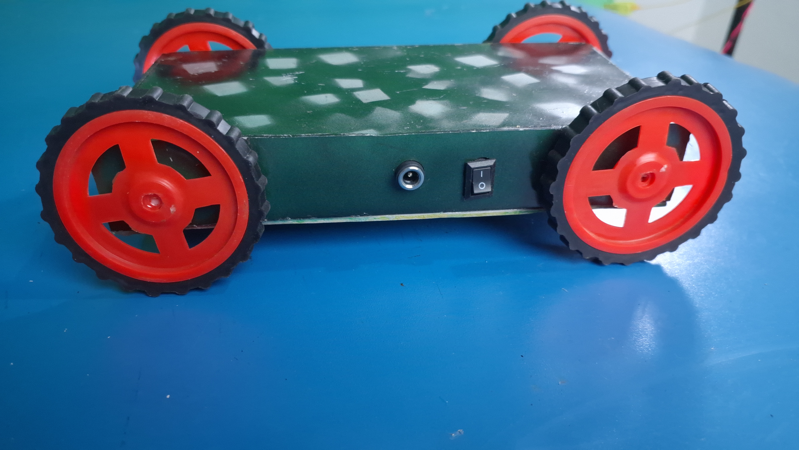
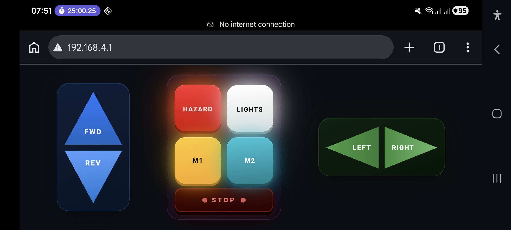
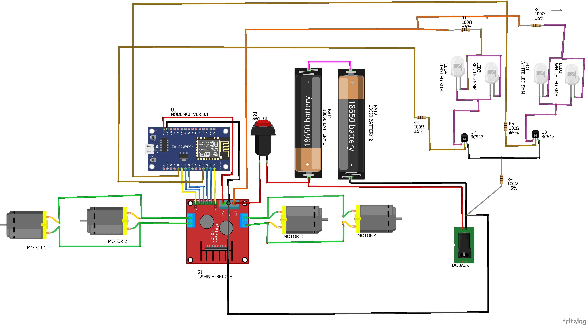

# 🚗 ESP8266 WiFi Controlled 4WD Smart Car

🔥 A fully wireless, app-controlled 4WD robot car powered by ESP8266 with a custom web-based joystick UI — no app required!

---

## 🎥 YouTube Demo

[](https://youtu.be/jsqwnJNBA3M)

▶️ Watch Full Project Video:
https://youtu.be/jsqwnJNBA3M

---

## 📸 Project Preview

### 🔧 Internal Wiring


### 🚗 Final Build



### 📲 Mobile Control UI



### 🔌 Circuit Diagram



---

## ⚡ Quick Start

1. Upload code to ESP8266 using Arduino IDE
2. Power the car
3. Connect mobile to WiFi: `CAR_v1.0`
4. Open browser → `192.168.4.1`
5. Control the car using UI

## ⚡ Features

- 📡 WiFi Control (No App Needed)
- 📱 Works directly in browser (`192.168.4.1`)
- 🎮 Real-time Touch Controls
- 🚗 4WD Drive (All Wheels Powered)
- 🔁 Forward / Reverse / Left / Right
- 💡 LED Controls
  - Hazard (blinking)
  - Headlights (ON/OFF)

- 🛑 Emergency Stop Mode (E-STOP)
- ⚙️ Dual Speed Modes
- 🎨 Modern Glass UI with animations
- 🔌 Battery powered (portable)

---

## 💡 Why This Project?

- No Android app required
- Works on any phone browser
- Clean UI design
- Easy to build
- Beginner + Advanced friendly

## 🧠 How It Works

1. ESP8266 creates its own WiFi hotspot
2. Mobile connects to that network
3. Open browser → `192.168.4.1`
4. UI loads → sends HTTP commands
5. ESP8266 processes → controls motors via L298N

---

## 🛠️ Hardware Used

| Component              | Quantity |
| ---------------------- | -------- |
| ESP8266 NodeMCU        | 1        |
| L298N Motor Driver     | 1        |
| BO Motors (Yellow)     | 4        |
| Wheels                 | 4        |
| 18650 Li-ion Batteries | 2        |
| Switch                 | 1        |
| LEDs (Red + White)     | 4        |
| Resistors (100Ω)       | 2        |
| Chassis                | 1        |

---

## 🔌 Pin Configuration

```
L298N:
IN1 → D1
IN2 → D2
IN3 → D5
IN4 → D6
ENA → D7
ENB → D0

LEDs:
RED LED   → D3
WHITE LED → D8
```

---

## 📱 Control Interface

- FWD / REV → Movement
- LEFT / RIGHT → Steering
- HAZARD → Blinking red LED
- LIGHTS → White LED
- M1 → High Speed
- M2 → Fast Turning
- STOP → Emergency shutdown

---

## 💻 Code Overview

Main logic:

- WiFi Access Point mode
- Web server (`ESP8266WebServer`)
- HTTP route-based control
- PWM motor control
- Non-blocking LED blinking

### Example

```cpp
server.on("/forward", HTTP_GET, []{
  forward();
  server.send(200,"text/plain","OK");
});
```

---

## 🔋 Power System

- Uses **2× 18650 Li-ion batteries**
- Direct supply to L298N
- ESP powered via onboard regulator

---

## 🚀 Applications

- DIY Robotics Learning
- IoT Projects
- STEM Education
- RC Vehicle Systems
- Industrial Prototyping

---

## 📈 Future Improvements

- 📷 Add ESP32-CAM for live video
- 📡 Add internet (cloud control)
- 🧠 Obstacle avoidance
- 🎮 Gamepad control
- 🔋 Battery monitoring system

---

## ⚠️ Notes

- Avoid using damaged pins (like D4, D10 if applicable)
- Use proper battery protection
- L298N reduces efficiency — can upgrade to TB6612FNG

---

## ❤️ Support

If this project helped you:

⭐ Star this repo
👍 Like & share
🔔 Subscribe for more projects

---

## 👨‍💻 Author

**Raju K**
Industrial IoT Engineer

🔗 GitHub: https://github.com/industrialiotengineer
